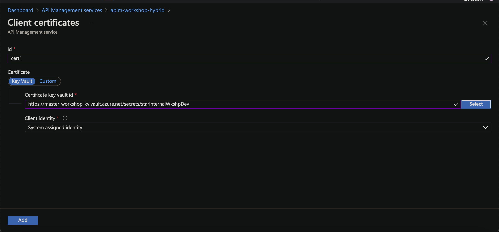
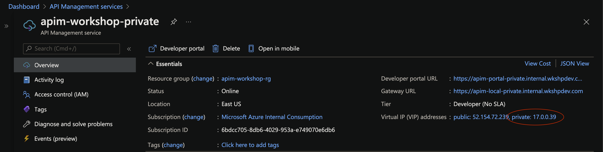
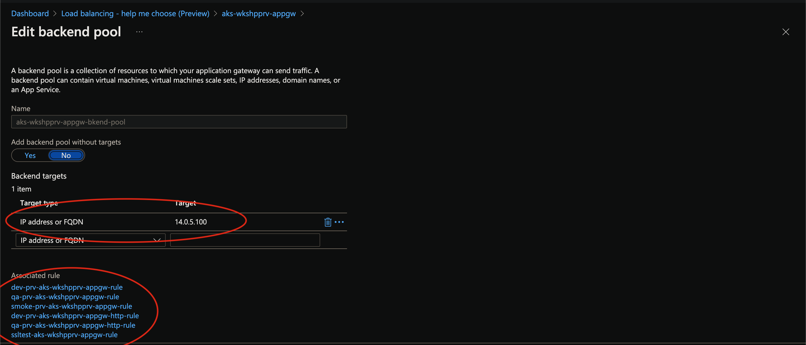
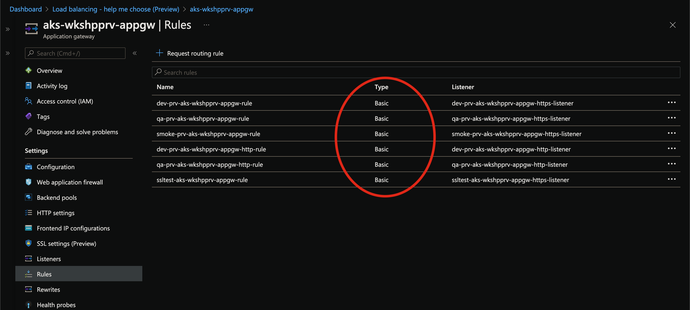
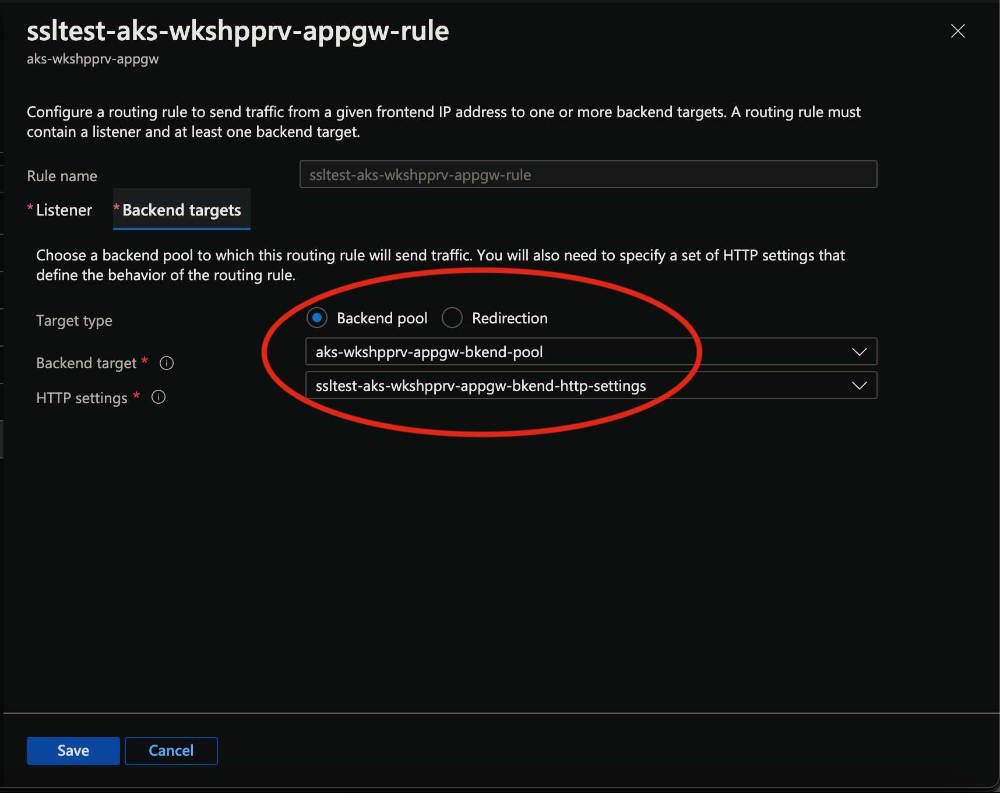
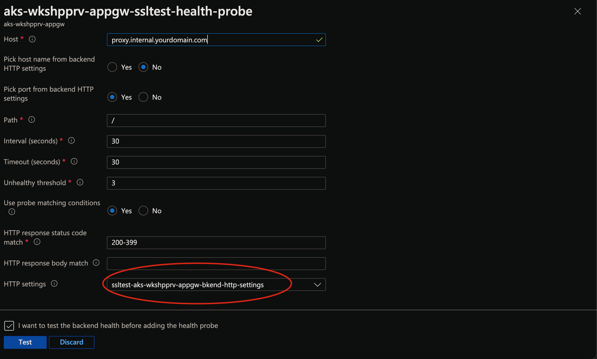
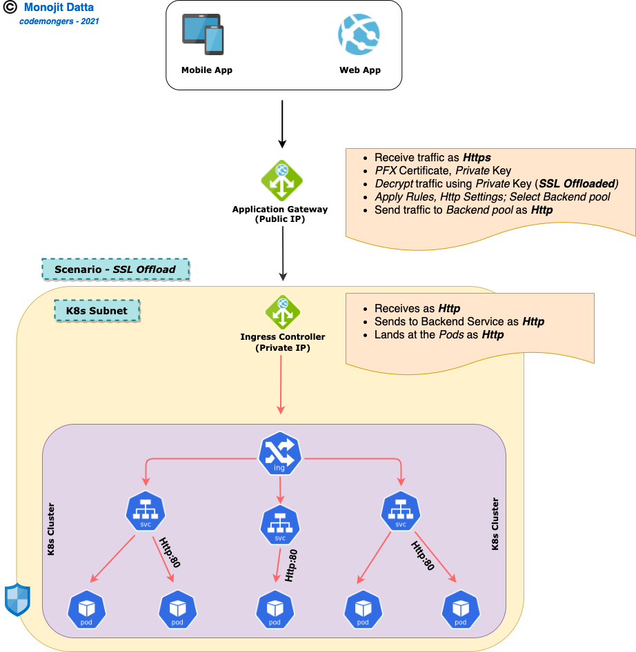
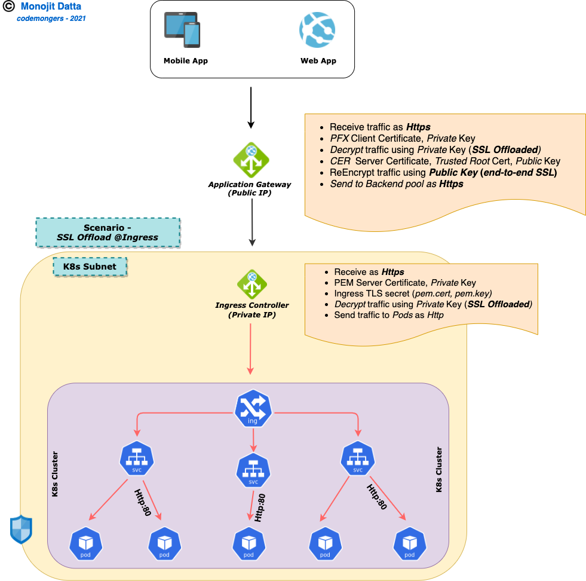
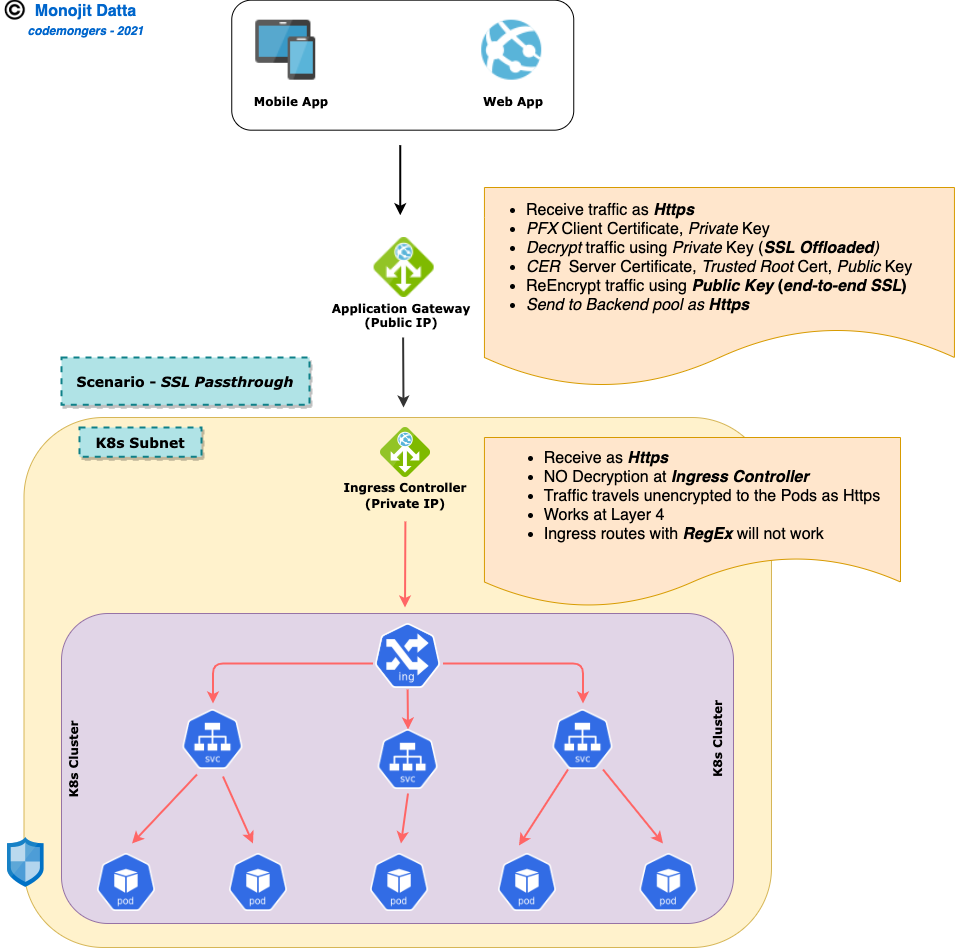

# Securely Manage APIs on Azure with AKS, APIM and Application Gateway


## Introduction

Ingress Security of Micro-services running within *K8s cluster* or as a *PasS* or *Serverless Function* is a basic requirement for Cloud Native applications. While *PaaS* and *Serverless* have options in-built being more managed and controlled services from Azure; but securing containerised applications, need additional steps and effort.

We had discussed those steps in details in [endtoendSSL](./endtoendSSL.md). This document would focus on another important Integration component of Azure - *API Management service* - which provides *Authentication, RBAC, API Policies, Routing* and many more...

### What the Document does

- Deep Insights of how Authentication and Policies in APIM works
- Describe *SSL* options involved in end to end communication
- What *Configurations* are needed for each *SSL option* at the Ingress end of AKS cluster
- End to End example - *Access APIs securely through Application Gateway* to *Ingress of AKS cluster* and finally to the *APIs inside the cluster*
- Although entire discussion is around AKS cluster as backend but is absolutely similar for UnManaged clusters on Azure like [CAPZ](https://capz.sigs.k8s.io/)

### What the Document does NOT

- Deep-dive into *AKS* and its associated components
- Deep-dive into *Azure APIM Service*
- Introduction of *Firewall* into this architecture - *<u>this would be addressed in a separate article with deep insights of Azure Firewall and how that integrates with this architecture</u>*
- Deployment automation of APIM or any other associated components

### Pre-requisites, Assumptions

- Knowledge of Azure APIM - *L200+*
- Knowledge on Containers, K8s, AKS - *L200+*
- Knowledge on Application Gateway  - *L200+*
- Knowledge on Azure tools & services viz. *Azure CLI, KeyVault, VNET* etc. - L200+
- Knowledge of SSL/TLS technology - *L200+*

## Plan

- #### Overview of API Management components
  - ##### APIs

    - APIs defined behind APIM

    - Each API is a collection of Operations

      

  - ##### Custom Domains

    - Refer [Here](https://docs.microsoft.com/en-us/azure/api-management/configure-custom-domain)

    - Map existing DNS name to the endppints exposed by APIM

      - **Gateway**

        - Default is: *<apim-service-name>.azure-api.net*

        - Multiple Domains can be configured as Gateway endpoint

        - Clients can call same APIM instance through ay of these custom endpoints

          

        

        - Corresponding SSL certificate for each Domain can be uploaded or referred through some KeyVault

          

      - **Developer portal**

        - Default is: *<apim-service-name>.developer.azure-api.net*

        - Provides Management plane for exposed APIs

        - All Exposed APIs are listed here; along with their Subscription Keys, if opted for

        - 3rd Party vendors can use this Portal to get New APIs and Updates as well as option to Test the APIs

          

        - Custom Domains can be configured as *Developer Portal* endpoint

        - Clients can use this custom endpoint to launch Developer Portal

          

          

      - **Management**

        - Default is: *<apim-service-name>.management.azure-api.net*
        - APIM instance as well as User of API management instance (the APIM operators) can use this url to make APIM management REST API calls

      - Each of the above Custom domians should be added as a CNAME record in the DNS server mapped to the original *Default Urls*

  - ##### OAuth+OIDC

    - Refer [Here](https://docs.microsoft.com/en-us/azure/api-management/api-management-howto-protect-backend-with-aad)

      

      [OAuth 2.0 and OpenID Connect protocols on the Microsoft identity platform](https://docs.microsoft.com/en-us/azure/active-directory/develop/active-directory-v2-protocols)

    - Native or Web Client should call AAD Graph API to acquire a *Bearer Token* with a certain expiry and pass this through Http Authorization Header to the API call

    - APIM acts like OAuth client and calls AAD Graph API to verify the *Bearer Token*

    - APIM acts as *Resource Owner* to Allow/Reject API access

      

      

  - ##### Manage CA Certificates

    - Certificates from KeyVault can be refrred Or Upload separately

    - *Does NOT work for Self Hosted gateway*

    - This is used to support HTTPS back end; and if NO custom Domain is configured for APIM

      

  - ##### Mutual TLS

    - Certificates from KeyVault can be refrred Or Upload separately

    - This is used for Client certificate validation; i.e. wher mTLS is intended

      

      

  - ##### Groups

    - Collection of API Users

    - Custom Groups can be created

    - Azure AD Groups can be integrated

      

      

  - ##### Products

    - Collection of APIs

    - RBAC can be applied at this level to manage a set of APIs with granular control

    - APIM Policies can be applied at this level

    - Detailed discussion is beyond the scope of this Article

      

      

      - Add APIs to the *Product*

      

      

      - Defione *Access Control* to a set of APIs through *Products*

      

  - ##### Custom Roles

    - [Refer Here](https://docs.microsoft.com/en-us/azure/api-management/api-management-role-based-access-control)
    - Detailed discussion is beyond the scope of this Article

- #### Overview of SSL Handshake flow

  

  ​					**<u>SSL Handshake</u>**

  

  - Communication can be between  - a *Client* process and a *Server* process Or a *Server* process and another *Server* process

  - Client always initiates the connection requesting a validation of the Server

  - Server responds with its *SSL Certificate*, which also contains the *Public* key. *Private* key is kept with the Server

  - *Client extracts the Public* key from the Certificate

  - Client then creates a *Master-Secret* known as *Pre-Master* key

  - Client *Encrypts* this newly created *Master-Secret* key

  - Client then sends this key back to Server

  - Server now *Decrypts* the *Master-Secret* key by using the *Private* key that it holds

  - Server Send a **<u>DONE</u>** acknowledgement message back to Client - ending the *SSL Handshake* process

  - The *Master-Secret* key is used as a *Symmetric* Key for all subsequent *Encryption/Decryption* - during communication on both directions i.e. *Client -> Server* OR *Server -> Client*


  

- #### Action Plan

  

  - ##### Application Gateway

    - Create *Application Gateway* resource
  - Configure *Backend Pool*
    - Configure *Multi-site Listeners* - supporting multiple tenants
  - Configure *Http Settings*
    - Configure *Health Probes* for each Http Settings
  - Configure *Rules* mapping with Http Settings and Backend Pool
    
- ##### API Management
  
  - Create *API Management* instance
    - Configure Network for APIM to an **External VNET** (*public IP*) Or **Internal VNET** (*Private IP*)
  - Define *Custom Domains* as needed
    - Add *Backend APIs*
  - Confgure *Backend APIs* to point to *Ingress Private IP*
  
- ##### AKS Cluster
  
  - Assuming an AKS cluster is created - *Public* or *Private*
  
  - Assuming an *Ingress Controller* is already deployed within above AKS cluster. The example in this exercise used Nginx as *Ingress Controller*
  
  - Configure Ingress object for below 3 SSL options
  
    - **SSL Offload**
  
    - **Backend Protocol - Https**
  
    - **SSL Pass-through**
  
- ##### Private DNS Zone
  
  - Resolve Private IP addresses on Azure
  
  - Application Gateway Host headers mapped to multiple tenants are added as A Record Set
  
  - All tenants are mapped onto the **Nginx Ingress** controller **Private** IP e.g.
  
    - ***<u>tenant-A</u>.<private-dns-zone>.com*** **->** ***<private-ip-of-nginx-ingress>***
  
    - ***<u>tenant-B</u>.<private-dns-zone>.com*** **->** ***<private-ip-of-nginx-ingress>***
  
    - ***<u>tenant-C</u>.<private-dns-zone>.com*** **->** ***<private-ip-of-nginx-ingress>***

## Action

- #### API Management

  - Create **APIM**

    - Ideally this should be done through ARM template; for this exercise we would assume that the resource would be created using Azure Portal

  - Configure *Network* for APIM

    

    

    - A Private IP is assigned to APIM instance

      

  - Configure *Custom Domain* for APIM endpoints

    - **Gateway**

      

      

      - Upload SSL certificates for *Custom Domain*

      

      

    - **Developer Portal**

      

      

  - Configure CA Certificates if mTLS is needed

  - Certificates from KeyVault can be refrred Or Upload separately

  - This is used for Client certificate validation; i.e. wher mTLS is intended

    

  - Configure [OAuth setup](https://docs.microsoft.com/en-us/azure/api-management/api-management-howto-protect-backend-with-aad)

  - Add Backend APIs to work with OAuth setup

    

  - Test the API through a REST client like POSTMAN

    

- #### Application Gateway

  - Create **Application Gateway**

    - Ideally this should be done through ARM template; for this exercise we would assume that the resource would be created using Azure Portal

  - Configure **Backend Pool**

    

    **<u>Backend Pool-View</u>**

    

    <u>**Backend Pool-Edit**</u>

  - Configure **Multi-site Listeners**

    

    **<u>Multi-site Listeners-View</u>**

    

    **Multi-site Listeners-Edit**

    

  - Configure **Http Settings**

    

    **Http Settings-View**

    

    **Http Settings-Edit**

    

    **Http Settings-Edit2**

    

  - Configure **Rules** mapping with *Http Settings* and *Backend Pool*

    

    **Rules-View**

    

    

    **Rules-Edit**

    

    **Rules-Edit2**

    

  - Configure **Health Probes** for each *Http Settings*

    

    **Health Probe-View**

    

    

    **Health Probe-Edit**

    

    

    **Health Probe-Edit2**

    

- #### AKS and Ingress

  - Create AKS cluster by any of the preferred ways - Azure CLI or ARM template or tools like Terraform

  - The preferred network plugin is Azure CNI as this example has been tested with this configuration

  - Install any preferred Ingress controller - this exercise uses Nginx as an option

    

- #### Final Bit

  ////////////////////////

  

  - ##### SSL Offload

    

    

    -  **PFX** certificate is uploaded at the **Https Listener**; this includes **Private** key

    - Application Gateway receives **Https** traffic; **Decrypts** incoming message using the **Private** key

    - **Backend Pool** is configured with **Nginx Ingress** Controller **Private** IP

    - A **Private DNS Zone** is created with the **Private** IP and different **host-headers**

    - All subsequent communication is over **Http** only and reaches **Nginx Ingress** controller (**Backend Pool**)

    - **Nginx Ingress** controller is an Internal LoadBalancer with **Private** IP (*allocated from a dedicated VNET ideally - Azure CNI*)

    - The K8s **Ingress** object behind **Nginx Ingress** controller defines the routing to various K8s **Services**

    - **Ingress** object has 3 different hosts defined with corresponding routing - ***tenant-A.<pvt-dns-zone>.com***

    - Request reaches the K8s **Services** as **Http** Only

    - All tenants are mapped onto the **Nginx Ingress** controller **Private** IP ([Private DNS Zone](#Private DNS Zone))

      

      ```yaml
      apiVersion: networking.k8s.io/v1beta1
      kind: Ingress
      metadata:
        name: aks-workshop-ingress
        namespace: aks-workshop-dev
        annotations:
          kubernetes.io/ingress.class: nginx    
          nginx.ingress.kubernetes.io/rewrite-target: /$1
          nginx.ingress.kubernetes.io/enable-cors: "true"
          nginx.ingress.kubernetes.io/proxy-body-size: "10m"    
      spec:
        rules:  
        - host: tenant-A.<pvt-dns-zone>.com
          http:
           paths:
            - path: /?(.*)
              backend:
                serviceName: <service-A-name>
                servicePort: 80
        - host: tenant-B.<pvt-dns-zone>.com
          http:
           paths:
            - path: /?(.*)
              backend:
                serviceName: <service-B-name>
                servicePort: 80
        - host: tenant-C.<pvt-dns-zone>.com
          http:
           paths:
            - path: /?(.*)
              backend:
                serviceName: <service-C-name>
                servicePort: 80
      ```

      

  - ##### SSL Offload @Ingress

    

    

    - **PFX** certificate is uploaded at the **Https Listener**; this includes **Private** key

    - **CER** certificate - ***Trusted Root Certificate*** of the **Backend Server** is uploaded at the **Https Listener**; this includes **Public** key

    - Application Gateway receives **Https** traffic; Decrypts incoming message using the **Private** key (***SSL Offloading @Application Gateway***)

    - **Backend Pool** is configured with **Nginx Ingress** Controller **Private** IP

    - Application Gateway **Re-Encrypts** the request again to be sent using the **Public** IP of the **CER** certificate

    - All subsequent communication is over **Https** only and reaches **Nginx Ingress** controller (**Backend Pool**)

    - **Nginx Ingress** controller is an Internal LoadBalancer with **Private** IP (*allocated from a dedicated VNET ideally - Azure CNI*)

    - The K8s **Ingress** object behind **Nginx Ingress** controller has **TLS K8s Secret** created and mapped

      ```yaml
      spec:
        rules:
        tls:
        - hosts:
          - "*.<pvt-dns-zone>.com"
          secretName: aks-workshop-tls-secret
          .............
          .............
      ```

      

    - The **TLS Secret** is the **Private** key of the **PEM** certificate provided by the **Backend Server**

      ```bash
      kubectl create secret tls aks-workshop-tls-secret -n aks-workshop-dev --cert="<cert-file-name>.pem" --key="<cert-file-name>.key"
      ```

    - The K8s **Ingress** object behind **Nginx Ingress** controller defines the routing to various K8s **Services**

    - Request reaches the K8s **Services** as **Http** Only

    - All tenants are mapped onto the **Nginx Ingress** controller **Private** IP ([Private DNS Zone](#Private DNS Zone))

      ```yaml
      apiVersion: networking.k8s.io/v1beta1
      kind: Ingress
      metadata:
        name: aks-workshop-ingress
        namespace: aks-workshop-dev
        annotations:
          kubernetes.io/ingress.class: nginx    
          nginx.ingress.kubernetes.io/rewrite-target: /$1
          nginx.ingress.kubernetes.io/enable-cors: "true"
          nginx.ingress.kubernetes.io/proxy-body-size: "10m"    
      spec:
        rules:
        tls:
        - hosts:
          - "*.<pvt-dns-zone>.com"
          secretName: aks-workshop-tls-secret
        - host: tenant-A.<pvt-dns-zone>.com
          http:
           paths:
            - path: /?(.*)
              backend:
                serviceName: <service-A-name>
                servicePort: 80
        - host: tenant-B.<pvt-dns-zone>.com
          http:
           paths:
            - path: /?(.*)
              backend:
                serviceName: <service-B-name>
                servicePort: 80
        - host: tenant-C.<pvt-dns-zone>.com
          http:
           paths:
            - path: /?(.*)
              backend:
                serviceName: <service-C-name>
                servicePort: 80
      ```

    

  - ##### Backend Protocol - HTTPS

    

    

    - **PFX** certificate is uploaded at the **Https Listener**; this includes **Private** key

    - **CER** certificate - ***Trusted Root Certificate*** of the **Backend Server** is uploaded at the **Https Listener**; this includes **Public** key

    - Application Gateway receives **Https** traffic; Decrypts incoming message using the **Private** key (***SSL Offloading @Application Gateway***)

    - **Backend Pool** is configured with **Nginx Ingress** Controller **Private** IP

    - Application Gateway **Re-Encrypts** the request again to be sent using the **Public** IP of the **CER** certificate

    - All subsequent communication is over **Https** only and reaches **Nginx Ingress** controller (**Backend Pool**)

    - **Nginx Ingress** controller is an Internal LoadBalancer with **Private** IP (*allocated from a dedicated VNET ideally - Azure CNI*)

    - The K8s **Ingress** object behind **Nginx Ingress** controller has **TLS K8s Secret** created and mapped

      ```yaml
      spec:
        rules:
        tls:
        - hosts:
          - "*.<pvt-dns-zone>.com"
          secretName: aks-workshop-tls-secret
          .............
          .............
      ```

      

    - The **TLS Secret** is the **Private** key of the **PEM** certificate provided by the **Backend Server**

      ```bash
      kubectl create secret tls aks-workshop-tls-secret -n aks-workshop-dev --cert="<cert-file-name>.pem" --key="<cert-file-name>.key"
      ```

    - **Nginx Ingress** controller annotation is used to specify the **backend-protocol**

      ```yaml
      nginx.ingress.kubernetes.io/backend-protocol: "HTTPS"
      ```

      

    - The K8s **Ingress** object behind **Nginx Ingress** controller defines the routing to various K8s **Services**

    - Request reaches the K8s **Services** as **Http** Only

    - All tenants are mapped onto the **Nginx Ingress** controller **Private** IP ([Private DNS Zone](#Private DNS Zone))

      ```yaml
      apiVersion: networking.k8s.io/v1beta1
      kind: Ingress
      metadata:
        name: aks-workshop-ingress
        namespace: aks-workshop-dev
        annotations:
          kubernetes.io/ingress.class: nginx    
          nginx.ingress.kubernetes.io/rewrite-target: /$1
          nginx.ingress.kubernetes.io/enable-cors: "true"
          nginx.ingress.kubernetes.io/proxy-body-size: "10m"  
          nginx.ingress.kubernetes.io/backend-protocol: "HTTPS"  
      spec:
        rules:
        tls:
        - hosts:
          - "*.<pvt-dns-zone>.com"
          secretName: aks-workshop-tls-secret
        - host: tenant-A.<pvt-dns-zone>.com
          http:
           paths:
            - path: /?(.*)
              backend:
                serviceName: <service-A-name>
                servicePort: 80
        - host: tenant-B.<pvt-dns-zone>.com
          http:
           paths:
            - path: /?(.*)
              backend:
                serviceName: <service-B-name>
                servicePort: 80
        - host: tenant-C.<pvt-dns-zone>.com
          http:
           paths:
            - path: /?(.*)
              backend:
                serviceName: <service-C-name>
                servicePort: 80
      ```

      

  - ##### SSL Passthrough

    

    

  - **PFX** certificate is uploaded at the **Https Listener**; this includes **Private** key

  - **CER** certificate - ***Trusted Root Certificate*** of the **Backend Server** is uploaded at the **Https Listener**; this includes **Public** key

  - Application Gateway receives **Https** traffic; Decrypts incoming message using the **Private** key (***SSL Offloading @Application Gateway***)

  - **Backend Pool** is configured with **Nginx Ingress** Controller **Private** IP

  - Application Gateway **Re-Encrypts** the request again to be sent using the **Public** IP of the **CER** certificate

  - All subsequent communication is over **Https** only and reaches **Nginx Ingress** controller (**Backend Pool**)

  - **Nginx Ingress** controller is an Internal LoadBalancer with **Private** IP (*allocated from a dedicated VNET ideally - Azure CNI*)

  - No **Decryption** at the **Nginx Ingress** end; SSL flows through till the backend **PODs**

  - **SSL Passthrough** works **Layer 4**

  - **<u>All L7 annotations stops working</u>**

  - Annotations like **rewrite-target** will not work; no **regular expressions** in the subsequent path routing

  - **Nginx Ingress** controller annotation is used to specify the **ssl passthrough**

    ```yaml
    nginx.ingress.kubernetes.io/ssl-passthrough: "true"
    ```

  - The K8s **Ingress** object behind **Nginx Ingress** controller defines the routing to various K8s **Services**

  - Request reaches the K8s **Services** as **Http** Only

  - All tenants are mapped onto the **Nginx Ingress** controller **Private** IP ([Private DNS Zone](#Private DNS Zone))

    ```yaml
    apiVersion: networking.k8s.io/v1beta1
    kind: Ingress
    metadata:
      name: aks-workshop-ingress
      namespace: aks-workshop-dev
      annotations:
        kubernetes.io/ingress.class: nginx        
        nginx.ingress.kubernetes.io/enable-cors: "true"
        nginx.ingress.kubernetes.io/proxy-body-size: "10m"  
        nginx.ingress.kubernetes.io/ssl-passthrough: "true"
    spec:
      rules:  
      - host: tenant-A.<pvt-dns-zone>.com
        http:
         paths:
          - path: /
            backend:
              serviceName: <service-A-name>
              servicePort: 80
          - path: /api/post
            backend:
              serviceName: <service-A2-name>
              servicePort: 80
      - host: tenant-B.<pvt-dns-zone>.com
        http:
         paths:
          - path: /api/another/post
            backend:
              serviceName: <service-B-name>
              servicePort: 80
      - host: tenant-C.<pvt-dns-zone>.com
        http:
         paths:
          - path: /
            backend:
              serviceName: <service-C-name>
              servicePort: 80
          - path: /api/yet/another/post
            backend:
              serviceName: <service-C2-name>
              servicePort: 80
    ```

    

## Future Enhancements

- InBound as well as OutBound Security with **Azure Firewall**
- **Azure APIM** for Securing backend APIs with *OAuth Authentication* and *API Policies*

## References

- Application gateway - https://docs.microsoft.com/en-us/azure/application-gateway/
- Features - https://docs.microsoft.com/en-us/azure/application-gateway/features
- Components - https://docs.microsoft.com/en-us/azure/application-gateway/application-gateway-components
- Listeners - https://docs.microsoft.com/en-us/azure/application-gateway/configuration-listeners
- Http Settings - https://docs.microsoft.com/en-us/azure/application-gateway/configuration-http-settings
- Request Routing Rules - https://docs.microsoft.com/en-us/azure/application-gateway/configuration-request-routing-rules
- SSL Termination - https://docs.microsoft.com/en-us/azure/application-gateway/ssl-overview
- Health Probe - https://docs.microsoft.com/en-us/azure/application-gateway/application-gateway-probe-overview
- Multi-Site Hosting - https://docs.microsoft.com/en-us/azure/application-gateway/multiple-site-overview

