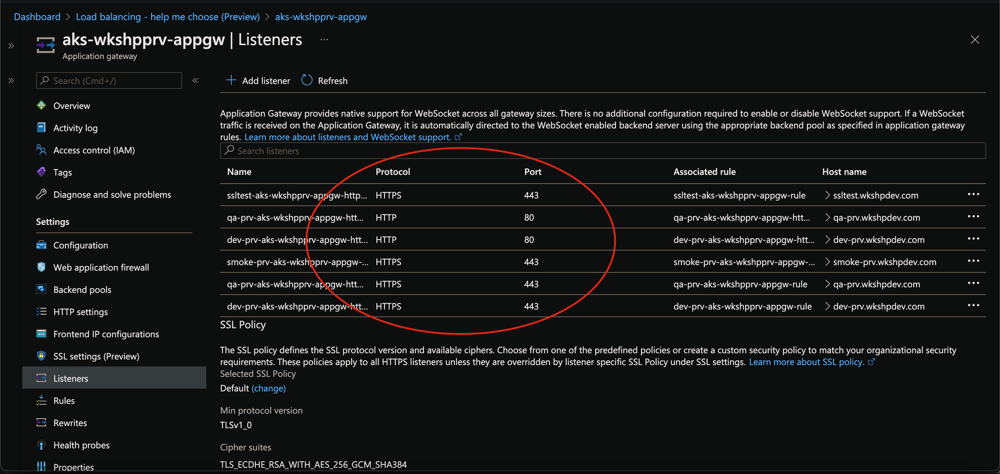
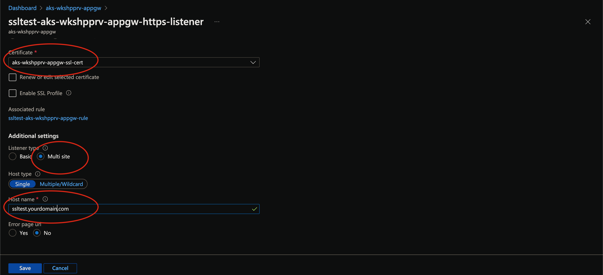
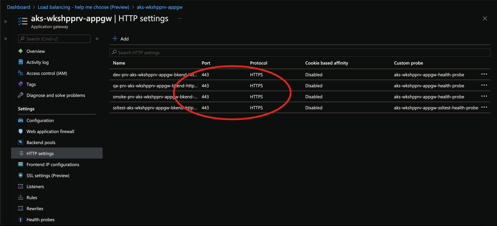
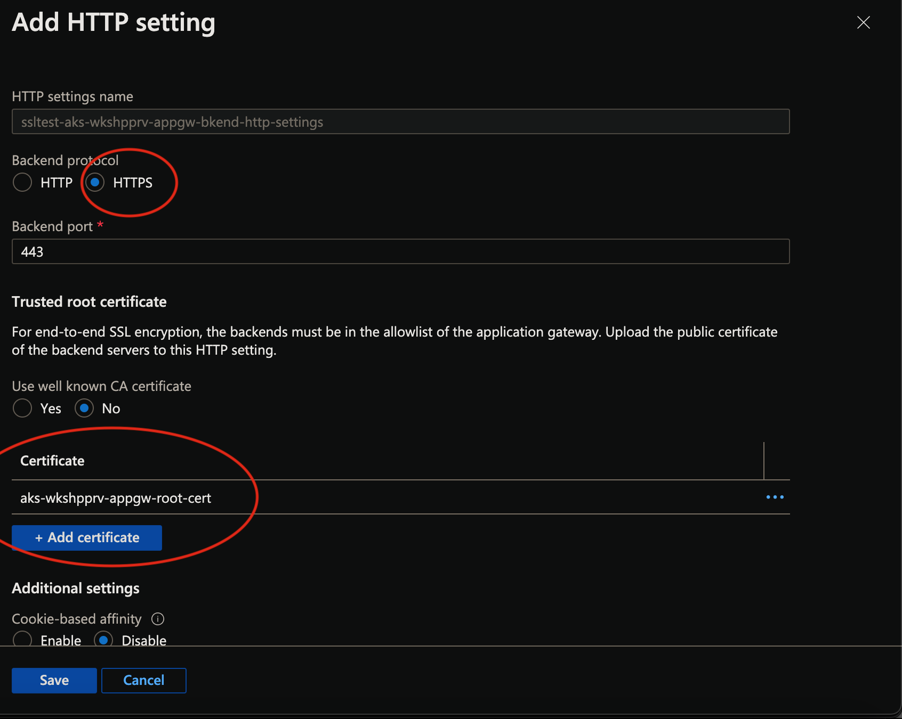
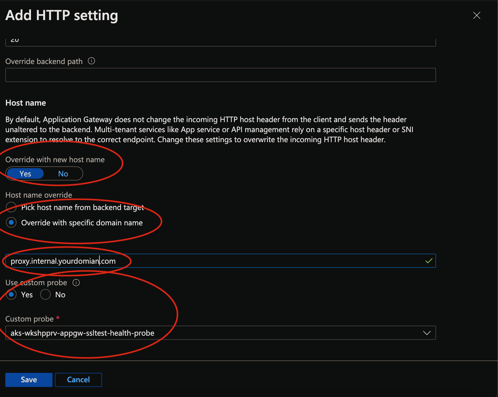
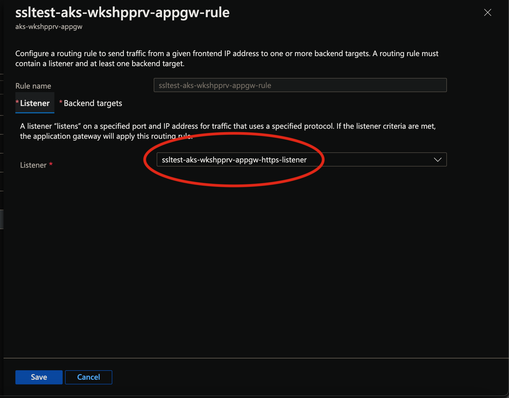

# Secure APIs on Azure with AKS and Application Gateway


## Introduction

Ingress Security of Micro-services running within *K8s cluster* or as a *PasS* or *Serverless Function* is a basic requirement for Cloud Native applications. While *PaaS* and *Serverless* have options in-built being more managed and controlled services from Azure; but securing containerised applications, need additional steps and effort.

The containerised, micro-service APIs can be deployed on any type of K8s clusters on Azure - *Unmanaged* or *Managed*. Following example would use AKS as an easy integration option but can be replaced by any type of K8s cluster on Azure e.g. CAPZ K8s cluster.

The other container deployment option is to use Container Groups or ACI (Azure Container Instances). Current discussion would exclude that for now.

### What the Document does

- High level overview of how *SSL* flow works
- High level overview of the *Entities* involved - *Application Gateway, AKS, Ingress Controller*
- Components that play major roles within each *Entities*
- Deep Insights of Application Gateway components and how they work together
- Describe *SSL* options involved in end to end communication
- What *Configurations* are needed for each *SSL option* at the Ingress end of AKS cluster
- End to End example - *Access APIs securely through Application Gateway* to *Ingress of AKS cluster* and finally to the *APIs inside the cluster*
- Although entire discussion is around AKS cluster as backend but is absolutely similar for UnManaged clusters on Azure like CAPZ(link)

### What the Document does NOT

- Deep-dive into AKS and its associated components
- Deep-dive into SSL/TLS technology
- Introduction of *Firewall* into this architecture - *<u>this would be addressed in a separate article with deep insights of Azure Firewall and how that integrates with this architecture</u>*
- Deployment automation of Application Gateway - *Although this is of utmost importance as can be seen later - with the complexities of Application Gateway components - having an automated, repetitive deployment process is very much necessary. This will be covered in a separate article in details*

### Pre-requisites, Assumptions

- Knowledge of SSL/TLS technology - *L200+*
- Knowledge on Containers, K8s, AKS - *L200+*
- Knowledge on Application Gateway  - *L200+*
- Knowledge on Azure tools & services viz. *Azure CLI, KeyVault, VNET* etc. - L200+


## Plan

- #### Overview of SSL Handshake flow

  

  ​					**<u>SSL Handshake</u>**

  

  - Communication can be between  - a *Client* process and a *Server* process Or a *Server* process and another *Server* process
  - Client always initiates the connection requesting a validation of the Server
  - Server responds with its *SSL Certificate*, which also contains the Public key. *Private* key is kept with the Server
  - *Client extracts the Public* key from the Certificate
  - Client then creates a *Master-Secret* known as *Pre-Master* key
  - Client *Encrypts* this newly created *Master-Secret* key
  - Client then sends this key back to Server
  - Server now *Decrypts* the *Master-Secret* key by using the *Private* key that it holds
  - Server Send a **<u>DONE</u>** acknowledgement message back to Client - ending the *SSL Handshake* process
  - The *Master-Secret* key is used as a *Symmetric* Key for all subsequent *Encryption/Decryption* - during communication on both directions i.e. *Client -> Server* OR *Server -> Client*

- #### Overview of Application Gateway components

  

  **<u>Application Gateway Overview</u>**

  - Application Gateway acts as a *reverse-proxy* and works at L7 protocol stack
  - Exposes *Public* IP and/or *Private* IP
  - **Backend Pool** - *Set of IP Addresses/FQDNs*, *Virtual Machine/VMSS*, *App Services*. This is the pool where Application Gateway can forward the Client request
  - For this exercise, we would use the **Ingress Controller** of *AKS* cluster as the Backend Pool. We will discuss in details below! So, the Private IP of the Ingress Controller would be our only entry in the Backend Pool
  - Provides *Web Application Firewall* (**WAF**) as one if its Tier; allowing protection from common vulnerabilities and is based on the **OWASP** rules(*link*)

  - **Http/s Listeners**

    - Listens for all incoming traffics
    - Supports both Http and Https clients
    - Clients that want to connect over Https, should upload the PFX Certificate (*containing the Private Key*) of their DNS server; during the Creation or Initial Configuration of Application Gateway
    - Application Gateway acts as a server for the Client that wants to connect. For Https, it uses the Private Key of PFX certificate to Decrypt message from Clients
    - **Basic**
      - *Single Tenant*
      - Client wants to connect to only single Backend Pool
    - **Multi-Site**
      - *Multi Tenant*
      - Same Client wants to connect to multiple backends based on **host-header** or *host-name*

  - **Http Rules**

    - **Basic**
      - *Single* backend host for the *Associated Listener*
      - *Routing* is handled the backend only (i.e. *in this case inside AKS cluster*); nothing to be decided at the Application Gateway level
    - **Path-Based**
      - *Route* to appropriate backend based on *Path* parameters
      - Same backend host but different internal paths - */backend/path1, /backend/path2* etc.

  - **Http Settings**

    

    **<u>Application Gateway - Host Headers</u>**

    - Defines Backend Http/S settings

    - **Http**

      - Client does not want SSL to flow through then it is offloaded at Application Gateway and subsequent communication is *Http*

    - **Https**

      - SSL to continue till *Backend host*
      - Need to upload **Trusted Toot Certificate** of the *Backend Server*
      - Here Application Gateway acts as the Client and *backend host* acts as the Server

    - **Health Probe**

      - *Monitors* the health pdf Backend Pool

      - Removes *Unhealthy* resources from Pool automatically and Puts them back when they are *healthy*

      - Consults with *Http Settings* and based on the configuration calls defined health probe route periodically

      - For backend systems like *AKS* or *APIM*, this is imperative that a custom health probe is specified while creating or configuring the Application Gateway

        

- #### Quick Run through of the AKS components

  

  ​																**<u>AKS- short-view</u>**

  - **AKS Cluster**
    - *Managed* K8s cluster
    - Sits within a *Azure Virtual Network* (dedicated *Subnet*)
    - **Ingress Controller** - The *Internal LoadBalancer* within AKS cluster with a Private IP address
    - **K8s Service** - Exposes Application PODs through the Ingress Controller
    - **K8s PODs** - Contains the Application code containerised

- #### Action Plan

  - ##### Application Gateway

    - Create *Application Gateway* resource

    - Configure *Backend Pool*

    - Configure *Multi-site Listeners* - supporting multiple tenants

    - Configure *Http Settings*

    - Configure *Health Probes* for each Http Settings

    - Configure *Rules* mapping with Http Settings and Backend Pool

      

  - ##### AKS Cluster

    - Assuming an AKS cluster is created - *Public* or *Private*

    - Assuming an *Ingress Controller* is already deployed within above AKS cluster. The example in this exercise used Nginx as *Ingress Controller*

    - Configure Ingress object for below 3 SSL options

      - **SSL Offload**

      - **Backend Protocol - Https**

      - **SSL Pass-through**

        

  - ##### Private DNS Zone

    - Resolve Private IP addresses on Azure
    - Application Gateway Host headers mapped to multiple tenants are added as A Record Set
    - All tenants are mapped onto the **Nginx Ingress** controller **Private** IP e.g.
      - ***<u>tenant-A</u>.<private-dns-zone>.com*** **->** ***<private-ip-of-nginx-ingress>***
      - ***<u>tenant-B</u>.<private-dns-zone>.com*** **->** ***<private-ip-of-nginx-ingress>***
      - ***<u>tenant-C</u>.<private-dns-zone>.com*** **->** ***<private-ip-of-nginx-ingress>***

## Action

- #### Application Gateway

  - Create **Application Gateway**

    - Ideally this should be done through ARM template; for this exercise we would assume that the resource would be created using Azure Portal

  - Configure **Backend Pool**

    

    **<u>Backend Pool-View</u>**

    

    <u>**Backend Pool-Edit**</u>

  - Configure **Multi-site Listeners**

    

    **<u>Multi-site Listeners-View</u>**

    

    **Multi-site Listeners-Edit**

    

  - Configure **Http Settings**

    

    **Http Settings-View**

    

    **Http Settings-Edit**

    

    **Http Settings-Edit2**

    

  - Configure **Rules** mapping with *Http Settings* and *Backend Pool*

    

    **Rules-View**

    

    

    **Rules-Edit**

    

    **Rules-Edit2**

    

  - Configure **Health Probes** for each *Http Settings*

    

    **Health Probe-View**

    

    

    **Health Probe-Edit**

    

    

    **Health Probe-Edit2**

    

- #### AKS and Ingress

  - Create AKS cluster by any of the preferred ways - Azure CLI or ARM template or tools like Terraform

  - The preferred network plugin is Azure CNI as this example has been tested with this configuration

  - Install any preferred Ingress controller - this exercise uses Nginx as an option

    

- #### Final Bit

  

  

  - ##### SSL Offload

    

    

    -  **PFX** certificate is uploaded at the **Https Listener**; this includes **Private** key

    - Application Gateway receives **Https** traffic; **Decrypts** incoming message using the **Private** key

    - **Backend Pool** is configured with **Nginx Ingress** Controller **Private** IP

    - A **Private DNS Zone** is created with the **Private** IP and different **host-headers**

    - All subsequent communication is over **Http** only and reaches **Nginx Ingress** controller (**Backend Pool**)

    - **Nginx Ingress** controller is an Internal LoadBalancer with **Private** IP (*allocated from a dedicated VNET ideally - Azure CNI*)

    - The K8s **Ingress** object behind **Nginx Ingress** controller defines the routing to various K8s **Services**

    - **Ingress** object has 3 different hosts defined with corresponding routing - ***tenant-A.<pvt-dns-zone>.com***

    - Request reaches the K8s **Services** as **Http** Only

    - All tenants are mapped onto the **Nginx Ingress** controller **Private** IP ([Private DNS Zone](#Private DNS Zone))

      

      ```yaml
      apiVersion: networking.k8s.io/v1beta1
      kind: Ingress
      metadata:
        name: aks-workshop-ingress
        namespace: aks-workshop-dev
        annotations:
          kubernetes.io/ingress.class: nginx    
          nginx.ingress.kubernetes.io/rewrite-target: /$1
          nginx.ingress.kubernetes.io/enable-cors: "true"
          nginx.ingress.kubernetes.io/proxy-body-size: "10m"    
      spec:
        rules:  
        - host: tenant-A.<pvt-dns-zone>.com
          http:
           paths:
            - path: /?(.*)
              backend:
                serviceName: <service-A-name>
                servicePort: 80
        - host: tenant-B.<pvt-dns-zone>.com
          http:
           paths:
            - path: /?(.*)
              backend:
                serviceName: <service-B-name>
                servicePort: 80
        - host: tenant-C.<pvt-dns-zone>.com
          http:
           paths:
            - path: /?(.*)
              backend:
                serviceName: <service-C-name>
                servicePort: 80
      ```

      

  - ##### SSL Offload @Ingress

    

    

    - **PFX** certificate is uploaded at the **Https Listener**; this includes **Private** key

    - **CER** certificate - ***Trusted Root Certificate*** of the **Backend Server** is uploaded at the **Https Listener**; this includes **Public** key

    - Application Gateway receives **Https** traffic; Decrypts incoming message using the **Private** key (***SSL Offloading @Application Gateway***)

    - **Backend Pool** is configured with **Nginx Ingress** Controller **Private** IP

    - Application Gateway **Re-Encrypts** the request again to be sent using the **Public** IP of the **CER** certificate

    - All subsequent communication is over **Https** only and reaches **Nginx Ingress** controller (**Backend Pool**)

    - **Nginx Ingress** controller is an Internal LoadBalancer with **Private** IP (*allocated from a dedicated VNET ideally - Azure CNI*)

    - The K8s **Ingress** object behind **Nginx Ingress** controller has **TLS K8s Secret** created and mapped

      ```yaml
      spec:
        rules:
        tls:
        - hosts:
          - "*.<pvt-dns-zone>.com"
          secretName: aks-workshop-tls-secret
          .............
          .............
      ```

      

    - The **TLS Secret** is the **Private** key of the **PEM** certificate provided by the **Backend Server**

      ```bash
      kubectl create secret tls aks-workshop-tls-secret -n aks-workshop-dev --cert="<cert-file-name>.pem" --key="<cert-file-name>.key"
      ```

    - The K8s **Ingress** object behind **Nginx Ingress** controller defines the routing to various K8s **Services**

    - Request reaches the K8s **Services** as **Http** Only

    - All tenants are mapped onto the **Nginx Ingress** controller **Private** IP ([Private DNS Zone](#Private DNS Zone))

      ```yaml
      apiVersion: networking.k8s.io/v1beta1
      kind: Ingress
      metadata:
        name: aks-workshop-ingress
        namespace: aks-workshop-dev
        annotations:
          kubernetes.io/ingress.class: nginx    
          nginx.ingress.kubernetes.io/rewrite-target: /$1
          nginx.ingress.kubernetes.io/enable-cors: "true"
          nginx.ingress.kubernetes.io/proxy-body-size: "10m"    
      spec:
        rules:
        tls:
        - hosts:
          - "*.<pvt-dns-zone>.com"
          secretName: aks-workshop-tls-secret
        - host: tenant-A.<pvt-dns-zone>.com
          http:
           paths:
            - path: /?(.*)
              backend:
                serviceName: <service-A-name>
                servicePort: 80
        - host: tenant-B.<pvt-dns-zone>.com
          http:
           paths:
            - path: /?(.*)
              backend:
                serviceName: <service-B-name>
                servicePort: 80
        - host: tenant-C.<pvt-dns-zone>.com
          http:
           paths:
            - path: /?(.*)
              backend:
                serviceName: <service-C-name>
                servicePort: 80
      ```

    

  - ##### Backend Protocol - HTTPS

    

    

    - **PFX** certificate is uploaded at the **Https Listener**; this includes **Private** key

    - **CER** certificate - ***Trusted Root Certificate*** of the **Backend Server** is uploaded at the **Https Listener**; this includes **Public** key

    - Application Gateway receives **Https** traffic; Decrypts incoming message using the **Private** key (***SSL Offloading @Application Gateway***)

    - **Backend Pool** is configured with **Nginx Ingress** Controller **Private** IP

    - Application Gateway **Re-Encrypts** the request again to be sent using the **Public** IP of the **CER** certificate

    - All subsequent communication is over **Https** only and reaches **Nginx Ingress** controller (**Backend Pool**)

    - **Nginx Ingress** controller is an Internal LoadBalancer with **Private** IP (*allocated from a dedicated VNET ideally - Azure CNI*)

    - The K8s **Ingress** object behind **Nginx Ingress** controller has **TLS K8s Secret** created and mapped

      ```yaml
      spec:
        rules:
        tls:
        - hosts:
          - "*.<pvt-dns-zone>.com"
          secretName: aks-workshop-tls-secret
          .............
          .............
      ```

      

    - The **TLS Secret** is the **Private** key of the **PEM** certificate provided by the **Backend Server**

      ```bash
      kubectl create secret tls aks-workshop-tls-secret -n aks-workshop-dev --cert="<cert-file-name>.pem" --key="<cert-file-name>.key"
      ```

    - **Nginx Ingress** controller annotation is used to specify the **backend-protocol**

      ```yaml
      nginx.ingress.kubernetes.io/backend-protocol: "HTTPS"
      ```

      

    - The K8s **Ingress** object behind **Nginx Ingress** controller defines the routing to various K8s **Services**

    - Request reaches the K8s **Services** as **Http** Only

    - All tenants are mapped onto the **Nginx Ingress** controller **Private** IP ([Private DNS Zone](#Private DNS Zone))

      ```yaml
      apiVersion: networking.k8s.io/v1beta1
      kind: Ingress
      metadata:
        name: aks-workshop-ingress
        namespace: aks-workshop-dev
        annotations:
          kubernetes.io/ingress.class: nginx    
          nginx.ingress.kubernetes.io/rewrite-target: /$1
          nginx.ingress.kubernetes.io/enable-cors: "true"
          nginx.ingress.kubernetes.io/proxy-body-size: "10m"  
          nginx.ingress.kubernetes.io/backend-protocol: "HTTPS"  
      spec:
        rules:
        tls:
        - hosts:
          - "*.<pvt-dns-zone>.com"
          secretName: aks-workshop-tls-secret
        - host: tenant-A.<pvt-dns-zone>.com
          http:
           paths:
            - path: /?(.*)
              backend:
                serviceName: <service-A-name>
                servicePort: 80
        - host: tenant-B.<pvt-dns-zone>.com
          http:
           paths:
            - path: /?(.*)
              backend:
                serviceName: <service-B-name>
                servicePort: 80
        - host: tenant-C.<pvt-dns-zone>.com
          http:
           paths:
            - path: /?(.*)
              backend:
                serviceName: <service-C-name>
                servicePort: 80
      ```

      

  - ##### SSL Passthrough

    

    

  - **PFX** certificate is uploaded at the **Https Listener**; this includes **Private** key

  - **CER** certificate - ***Trusted Root Certificate*** of the **Backend Server** is uploaded at the **Https Listener**; this includes **Public** key

  - Application Gateway receives **Https** traffic; Decrypts incoming message using the **Private** key (***SSL Offloading @Application Gateway***)

  - **Backend Pool** is configured with **Nginx Ingress** Controller **Private** IP

  - Application Gateway **Re-Encrypts** the request again to be sent using the **Public** IP of the **CER** certificate

  - All subsequent communication is over **Https** only and reaches **Nginx Ingress** controller (**Backend Pool**)

  - **Nginx Ingress** controller is an Internal LoadBalancer with **Private** IP (*allocated from a dedicated VNET ideally - Azure CNI*)

  - No Decryption at the Nginx Ingress end; SSl flows through till the backend PODs

  - **Nginx Ingress** controller annotation is used to specify the **backend-protocol**

    ```yaml
    nginx.ingress.kubernetes.io/backend-protocol: "HTTPS"
    ```

  - The K8s **Ingress** object behind **Nginx Ingress** controller defines the routing to various K8s **Services**

  - Request reaches the K8s **Services** as **Http** Only

  - All tenants are mapped onto the **Nginx Ingress** controller **Private** IP ([Private DNS Zone](#Private DNS Zone))

  


## Summary


## References