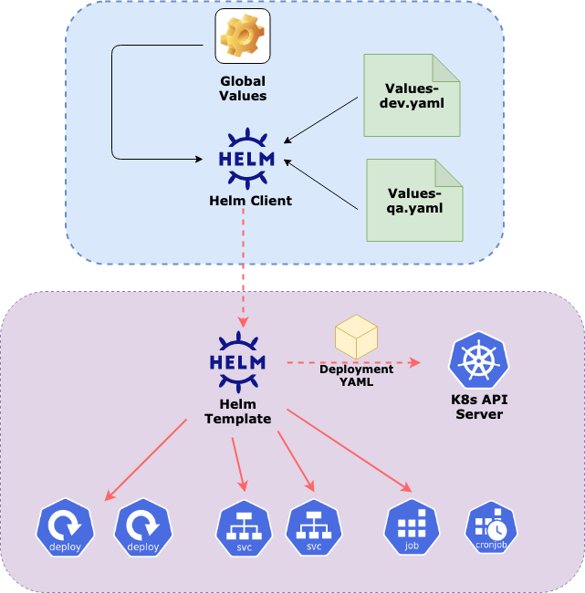
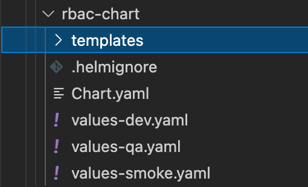
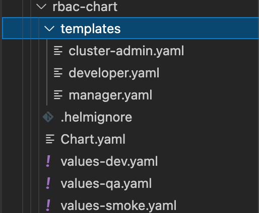
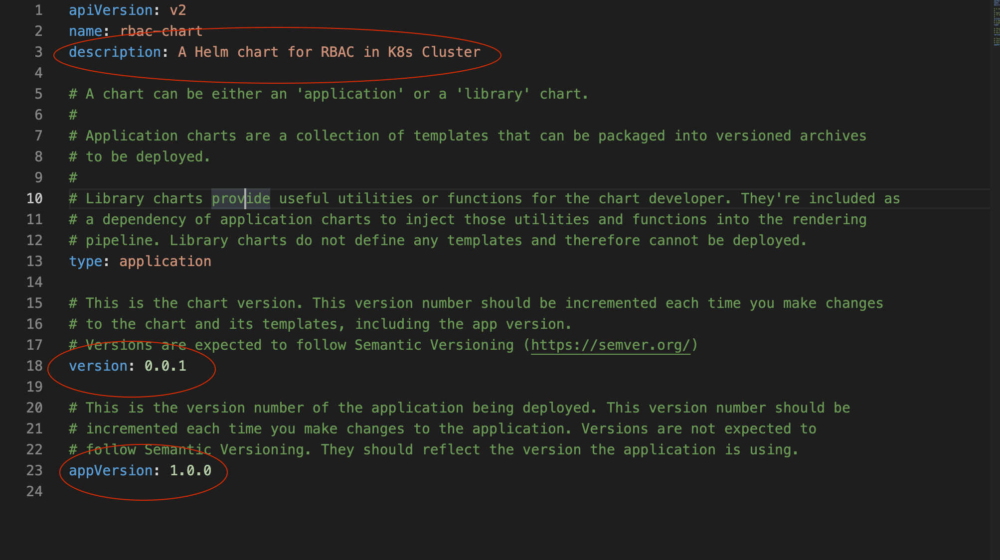
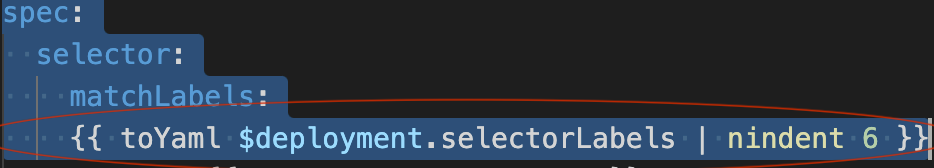
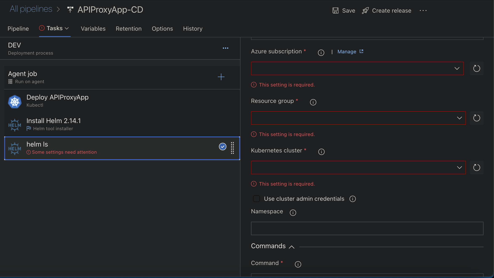
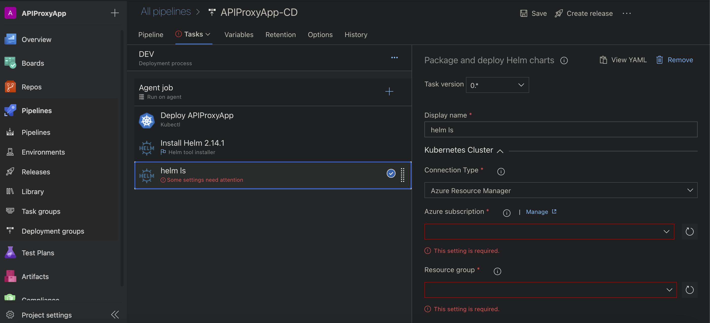
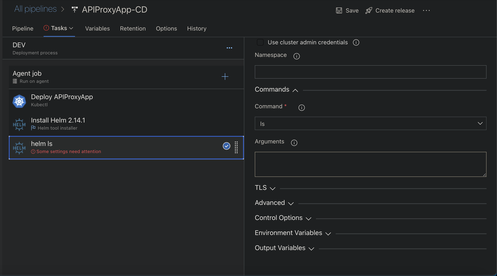

# Deploy Cloud Native Apps - Happy Helming...




## Introduction

[TBD}]

## What the Document does

- An overview of Helm chart and its components
- An insight into the Architecture of Helm
- A deep look at how Helm chart can be used to deploy Containerized applications onto K8s clusters
- Anatomy of Helm chart templates and configurations
- Some hands-on examples
- A quick showcase of how Helm can work with Azure DevOps to automate application deployment

## What It does not

- This is NOT a tutorial for Helm chart
- This is NOT a workshop or Hands-on-Lab for Helm chart
- This does NOT teah K8s or AKS

### Pre-requisites, Assumptions

- Knowledge on Containers, K8s, AKS - *L200+*
- Knowledge on Azure DevOps. - L200+

## Components

- **Chart.yaml**

  - Contains information about the chart

  - Modify *Description*

  - Modify *Chart Version*

  - Modify *App Version*

  - **Example**

    ```yaml
    apiVersion: v2
    name: ratingsapi-chart
    description: A Helm chart for Ratings API
    
    # A chart can be either an 'application' or a 'library' chart.
    #
    # Application charts are a collection of templates that can be packaged into versioned archives
    # to be deployed.
    #
    # Library charts provide useful utilities or functions for the chart developer. They're included as
    # a dependency of application charts to inject those utilities and functions into the rendering
    # pipeline. Library charts do not define any templates and therefore cannot be deployed.
    type: application
    
    # This is the chart version. This version number should be incremented each time you make changes
    # to the chart and its templates, including the app version.
    # Versions are expected to follow Semantic Versioning (https://semver.org/)
    version: 0.0.1
    
    # This is the version number of the application being deployed. This version number should be
    # incremented each time you make changes to the application. Versions are not expected to
    # follow Semantic Versioning. They should reflect the version the application is using.
    appVersion: 1.0.0
    ```

- **values.yaml** - configuration values for this chart

  - **Example**

    ```yaml
    deployment:
      name: ratingsapi-deploy
      namespace: aks-workshop-dev
      labels:
        app: ratingsapi-deploy
      selectorLabels:
        app: ratingsapi-pod    
      replicas: 2
      strategyType: RollingUpdate
      maxSurge: 1
      maxUnavailable: 1
      nodeSelector:
        agentpool: aksapipool
      containers:
      - name: ratingsapi-app
        image: akswkshpacr.azurecr.io/ratings-api:v1.0.0
        imagePullPolicy: IfNotPresent
        readinessPort: 3000
        readinessPath: /healthz
        livenessPort: 3000
        livenessPath: /healthz
        memoryRequest: "64Mi"
        cpuRequest: "100m"
        memoryLimit: "256Mi"
        cpuLimit: "200m"
        containerPorts: [3000]    
        env:          
        - name: MONGODB_URI
          valueKey: MONGOCONNECTION
          valueSecret: aks-workshop-mongo-secret
    service:
      name: ratingsapi-service
      namespace: aks-workshop-dev
      selector:
        app: ratingsapi-pod
      type: ClusterIP
      ports:
      - protocol: TCP
        port: 80
        targetPort: 3000
    ```

- **Chart Templates**

  - Contains multiple *Chart templates*
  - All templates are deployed at once
  - Each Template contains the definition of a *K8s* object
    - Same format as original *Deployment* YAML file
    - Values are replaced by templatized values; to be filled up by corresponding values from *Values* YAML file at runtime

## Let us Get into some Action

- ### Create Helm Chart

  ```bash
  helm create <chart-name>
  ```

  

  

  

  

  

  - #### Understand Folder structure

    - **templates**
      - Contains multiple template yamls
    - **.helmignore**
      - File containing entries that should NOT be included in the helm package
    - **values-xxx.yaml**
      - Configuration values for the chart

  - #### Configure Chart Release

    - **Chart.yaml**

      

      - Contains information about the chart
      - Modify *Description*
      - Modify *Chart Version*
      - Modify *App Version*

- ### Define a Chart Template

  - #### Conditions

    - Check existence of an item in yaml

      ```yaml
      {{ if $ingress.annotations.rewriteTarget }}
          nginx.ingress.kubernetes.io/rewrite-target: {{ $ingress.annotations.rewriteTarget }}
      {{ end }}
      ```

  - #### Loops

    - Repetitive entries in yaml

      ```yaml
      {{- range $host := $ingress.hosts }}
        - host: {{ $host.name}}
          http:
            paths:
            {{- range $path := $host.paths }}
            - path: {{ $path.path }}
              pathType: {{ $path.pathType }}
              backend:
                service:
                  name: {{ $path.service }}
                  port:
                    number: {{ $path.port }}
            {{- end }}
        {{- end }}
      ```

    - *range* denotes the start of the Loop block

    - *{{- end }}* denotes the end of the Loop block

    - Assign items in the Loop block in a variable

      ```bash
      $host := $ingress.hosts
      ......
      $path := $host.paths
      ```

      

  - #### Assign Single Key/Value pair

    - Single Value assignments are straight forward

      ```bash
      pathType: {{ $path.pathType }}
      ```

  - #### Assign Multiple Key/Value pairs

    - Multiple Value assignments are perfoermed using *toYaml* keyword

    - Indentation is for successful assignment

      - **Note *nindent* value - 6**

      ```yaml
      spec:
        selector:
          matchLabels:
      		{{ toYaml $deployment.selectorLabels | nindent 6 }}
      ```

      

    - **4 Blank spaces from Left + 2 TAB spaces (*standard K8s object hierarchy*)**

    - **Few More Examples**

      - **Note *nindent* value - 8**

      ```yaml
        template:
          metadata:
            labels:
            {{ toYaml $deployment.selectorLabels | nindent 8 }}
      ```

      - **Note *nindent* value - 4**

      ```yaml
      metadata:
        name: {{ $deployment.name }}
        namespace: {{ $deployment.namespace }}
        labels:
        {{ toYaml $deployment.labels | nindent 4 }}
      ```

      

  - #### Examples

    - ##### Deployment

      ```yaml
      {{ $deployment := .Values.deployment }}
      apiVersion: apps/v1
      kind: Deployment
      metadata:
        name: {{ $deployment.name }}
        namespace: {{ $deployment.namespace }}
        labels:
        {{ toYaml $deployment.labels | nindent 4 }}
      spec:
        selector:
          matchLabels:
          {{ toYaml $deployment.selectorLabels | nindent 6 }}
        replicas: {{ $deployment.replicas }}
        strategy:
          type: {{ $deployment.strategyType }}
          rollingUpdate:
            maxSurge: {{ $deployment.maxSurge }}
            maxUnavailable: {{ $deployment.maxUnavailable }}
        template:
          metadata:
            labels:
            {{ toYaml $deployment.selectorLabels | nindent 8 }}
          spec:
            nodeSelector:
            {{ toYaml $deployment.nodeSelector | nindent 8 }}
            {{ if $deployment.imagePullSecrets }}
            {{- range $secret := $deployment.imagePullSecrets }}
            imagePullSecrets:
            - name: {{ $secret.name }}
            {{- end}}
            {{ end }}
            containers:
            {{- range $container := $deployment.containers }}
            - name: {{ $container.name }}
              image: {{ $container.image }}
              imagePullPolicy: {{ $container.imagePullPolicy }}
              resources:
                requests:
                  memory: {{ $container.memoryRequest }}
                  cpu: {{ $container.cpuRequest }}
                limits:
                  memory: {{ $container.memoryLimit }}
                  cpu: {{ $container.cpuLimit }}
              {{ if and $container.readinessPort $container.readinessPath}}
              readinessProbe:
                httpGet:
                  port: {{ $container.readinessPort }}
                  path: {{ $container.readinessPath }}
              {{ end }}
              {{ if and $container.livenessPort $container.livenessPath }}
              livenessProbe:
                httpGet:
                  port: {{ $container.livenessPort }}
                  path: {{ $container.livenessPath }}
              {{ end }}
              env:
              {{- range $env := $container.env }}
              - name: {{ $env.name }}
                valueFrom:
                  secretKeyRef:
                    key: {{ $env.valueKey }}
                    name: {{ $env.valueSecret }}
              {{- end }}
              ports:
              {{- range $containerPort := $container.containerPorts }}
              - containerPort: {{ $containerPort }}
              {{- end }}
            {{- end }}      
      ```

    - ##### Service

      ```yaml
      {{ $service := .Values.service }}
      apiVersion: v1
      kind: Service
      metadata:
        name: {{ $service.name }}
        namespace: {{ $service.namespace }}
      spec:
        selector:
        {{ toYaml $service.selector | nindent 4}}
        ports:
        {{ range $port := $service.ports }}
        - protocol: {{ $port.protocol }}
          port: {{ $port.port }}
          targetPort: {{ $port.targetPort }}
        {{ end }}
        type: ClusterIP
      ```

    - ##### RBAC

      ```yaml
      apiVersion: rbac.authorization.k8s.io/v1
      kind: Role
      metadata:
        name: {{ .Values.developer.roleName }}
        namespace: {{ .Values.developer.roleNamespace }}
      rules:
      {{- range $rule := .Values.developer.rules}}
      - apiGroups: {{ $rule.apiGroups }}
        resources: {{ $rule.resources }}
        verbs: {{ $rule.verbs }}
      {{- end }}
      
      ---
      apiVersion: rbac.authorization.k8s.io/v1
      kind: RoleBinding
      metadata:
        name: {{ .Values.developer.bindingName }}
        namespace: {{ .Values.developer.bindingNamespace }}
      roleRef:
        apiGroup: rbac.authorization.k8s.io
        kind: Role
        name: {{ .Values.developer.roleName }}
      subjects:
      {{- range $subject := .Values.developer.subjects}}
      - apiGroup: rbac.authorization.k8s.io
        name: {{  $subject.name }}
        kind: {{  $subject.kind }}
      {{- end }}
      ```

      ```yaml
      apiVersion: rbac.authorization.k8s.io/v1
      kind: Role
      metadata:
        name: {{ .Values.manager.roleName }}
        namespace: {{ .Values.manager.roleNamespace }}
      rules:
      {{- range $rule := .Values.developer.rules}}
      - apiGroups: {{ $rule.apiGroups }}
        resources: {{ $rule.resources }}
        verbs: {{ $rule.verbs }}
      {{- end }}
      
      ---
      apiVersion: rbac.authorization.k8s.io/v1
      kind: RoleBinding
      metadata:
        name: {{ .Values.manager.bindingName }}
        namespace: {{ .Values.manager.bindingNamespace }}
      roleRef:
        apiGroup: rbac.authorization.k8s.io
        kind: Role
        name: {{ .Values.manager.roleName }}
      subjects:
      {{- range $subject := .Values.manager.subjects}}
      - apiGroup: rbac.authorization.k8s.io
        name: {{ $subject.name }}
        kind: {{ $subject.kind }}
      {{- end }}
      ```

      ```yaml
      {{if not (lookup "rbac.authorization.k8s.io/v1" "ClusterRoleBinding" "" "aks-workshop-cluster-admin-bindings") }}
      apiVersion: rbac.authorization.k8s.io/v1
      kind: ClusterRoleBinding
      metadata:
        name: {{ .Values.clusteradmin.name }}
      roleRef:
        apiGroup: rbac.authorization.k8s.io
        kind: ClusterRole
        name: {{ .Values.clusteradmin.roleName }}
      subjects:
      - apiGroup: rbac.authorization.k8s.io
        name: {{ (index .Values.clusteradmin.subjects 0).name}}
        kind: {{ (index .Values.clusteradmin.subjects 0).kind}}
      {{ end }}
      ```

    - ##### Ingress

      ```yaml
      {{ $ingress := .Values.ingress }}
      apiVersion: networking.k8s.io/v1
      kind: Ingress
      metadata:
        name: {{ $ingress.name }}    
        namespace: {{ $ingress.namespace }}  
        annotations:
          kubernetes.io/ingress.class: {{ $ingress.annotations.ingressClass }}
          {{ if $ingress.annotations.rewriteTarget }}
          nginx.ingress.kubernetes.io/rewrite-target: {{ $ingress.annotations.rewriteTarget }}
          {{ end }}  
          {{ if $ingress.annotations.enableCors }}
          nginx.ingress.kubernetes.io/enable-cors: {{ $ingress.annotations.enableCors | quote }}
          {{ end }}  
          {{ if $ingress.annotations.proxyBodySize }}
          nginx.ingress.kubernetes.io/proxy-body-size: {{ $ingress.annotations.proxyBodySize }}
          {{ end }}
          {{ if $ingress.annotations.backendProtocol }}
          nginx.ingress.kubernetes.io/backend-protocol: {{ $ingress.annotations.backendProtocol }}
          {{ end }}
          {{ if $ingress.annotations.sslpassThrough }}
          nginx.ingress.kubernetes.io/ssl-passthrough: {{ $ingress.annotations.sslpassThrough | quote }}
          {{ end }}    
      spec:
        rules:
        {{- range $host := $ingress.hosts }}
        - host: {{ $host.name}}
          http:
            paths:
            {{- range $path := $host.paths }}
            - path: {{ $path.path }}
              pathType: {{ $path.pathType }}
              backend:
                service:
                  name: {{ $path.service }}
                  port:
                    number: {{ $path.port }}
            {{- end }}
        {{- end }}
        {{ if $ingress.tls }}
        tls:
        {{- range $tls := $ingress.tls }}
        - hosts:
          {{- range $tlsHost := $tls.hosts }}
          - {{ $tlsHost | quote }}
          {{- end }}
          secretName: {{ $tls.secretName }}
        {{- end }}
        {{ end }}
      ```

      

- ### Define Values for the Chart

  - #### Flat vs Hierarchial

    - 

  - #### Examples

    - ##### Deployment

      ```yaml
      deployment:
        name: ratingsapi-deploy
        namespace: aks-workshop-dev
        labels:
          app: ratingsapi-deploy
        selectorLabels:
          app: ratingsapi-pod    
        replicas: 2
        strategyType: RollingUpdate
        maxSurge: 1
        maxUnavailable: 1
        nodeSelector:
          agentpool: aksapipool
        containers:
        - name: ratingsapi-app
          image: <acrName>.azurecr.io/ratings-api:v1.0.0
          imagePullPolicy: IfNotPresent
          readinessPort: 3000
          readinessPath: /healthz
          livenessPort: 3000
          livenessPath: /healthz
          memoryRequest: "64Mi"
          cpuRequest: "100m"
          memoryLimit: "256Mi"
          cpuLimit: "200m"
          containerPorts: [3000]    
          env:          
          - name: MONGODB_URI
            valueKey: MONGOCONNECTION
            valueSecret: aks-workshop-mongo-secret
      ```

      

    - ##### Service

      ```yaml
      service:
        name: ratingsapi-service
        namespace: aks-workshop-dev
        selector:
          app: ratingsapi-pod
        type: ClusterIP
        ports:
        - protocol: TCP
          port: 80
          targetPort: 3000
      ```

      

    - ##### RBAC

      ```yaml
      clusteradmin:
        name: aks-workshop-cluster-admin-bindings
        roleName: cluster-admin
        subjects:
        - name: <>
          kind: User
      
      developer:
        roleName: aks-workshop-developer-roles
        roleNamespace: aks-workshop-dev
        rules:
        - apiGroups: ["", "apps", "networking.k8s.io"]
          resources: ["configmaps", "pods", "pods/exec", "pods/log", "deployments", "services", "events", "ingresses"]
          verbs: ["create", "delete", "deletecollection", "get", "list", "patch", "update", "watch"]
        bindingName: aks-workshop-developer-rb
        bindingNamespace: aks-workshop-dev
        subjects:
        - name: <>
          kind: Group
      
      manager:
        roleName: aks-workshop-manager-roles
        roleNamespace: aks-workshop-dev
        rules:
        - apiGroups: ["", "apiextensions.k8s.io", "apps", "autoscaling", "batch", "events.k8s.io", "networking.k8s.io", "policy", "rbac.authorization.k8s.io", "scheduling.k8s.io"]
          resources: ["configmaps", "endpoints", "events", "limitranges", "persistentvolumeclaims", "pods", "resourcequotas", "serviceaccounts", "namespaces", "services", "customresourcedefinitions", "daemonsets", "deployments", "replicasets", "statefulsets", "horizontalpodautoscalers", "cronjobs", "jobs", "events", "ingresses", "networkpolicies", "poddisruptionbudgets", "rolebindings", "roles", "priorityclasses"]
          verbs: ["create", "delete", "deletecollection", "get", "list", "patch", "update", "watch"]
        - apiGroups: ["metrics.k8s.io"]
          resources: ["nodes", "pods"]
          verbs: ["get", "list"]
        bindingName: aks-workshop-manager-rb
        bindingNamespace: aks-workshop-dev
        subjects:
        - name: <>
          kind: Group
      ```

      

    - ##### Ingress

      - Standard Ingress

      ```yacas
      ingress:
        name: aks-workshop-ingress
        namespace: aks-workshop-dev
        annotations:
          ingressClass: nginx
          proxyBodySize: "10m"
          enableCors: "true"
          rewriteTarget: /$1    
        hosts:
        - name: <dns-server>
          paths:    
          - path: /?(.*)
            pathType: Prefix
            service: ratingsweb-service
            port: 80    yaml
      ```

      

- ### Install/Upgrade the Chart

  ```bash
  helm install <chart-name> -n aks-workshop-dev ./<chart-name>/ -f ./<chart-name>/values-dev.yaml
  ```

  ```bash
  helm upgrade <chart-name> -n aks-workshop-dev ./<chart-name>/ -f ./<chart-name>/values-dev.yaml
  ```

  

- ### UnInstall the Chart

  ```
  helm uninstall <chart-name>
  ```

  

- ### Integration with Azure DevOps

  - *Helm* deployment Task in *Azure DevOps*

    - https://docs.microsoft.com/en-us/azure/devops/pipelines/tasks/deploy/helm-deploy?view=azure-devops

    

    

    

    

## References

- [Helm Docs](https://helm.sh/docs/)
- [Helm Charts](https://helm.sh/docs/topics/charts/)
- [Developer's Guide](https://helm.sh/docs/chart_template_guide/)
- [Az DevOps with Helm](https://docs.microsoft.com/en-us/azure/devops/pipelines/tasks/deploy/helm-deploy?view=azure-devops)